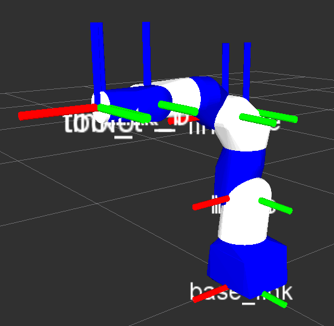
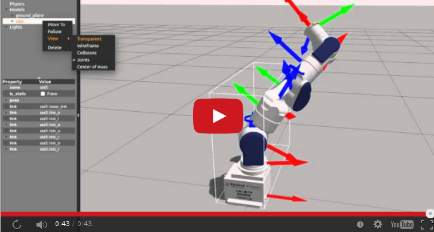
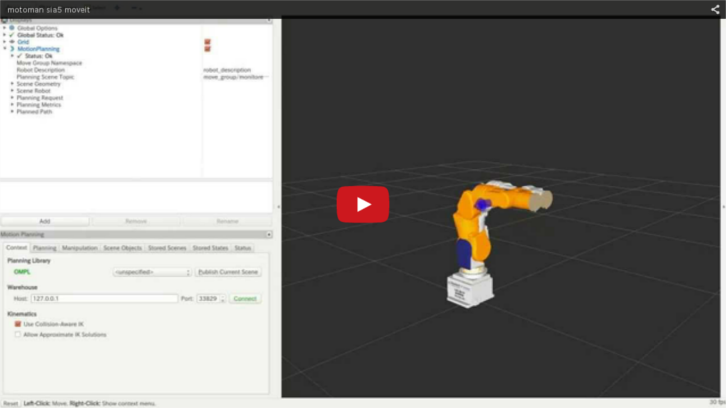
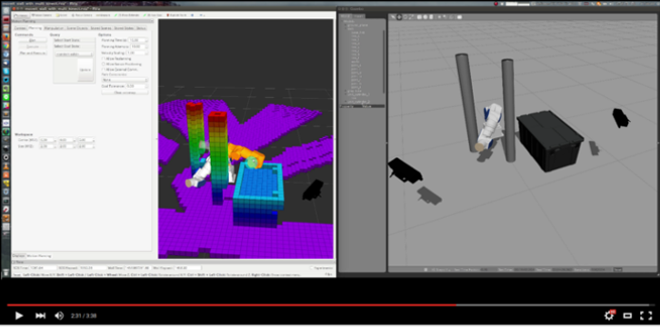

# Motoman Project  

## Installation
* [Japanese](https://github.com/Nishida-Lab/motoman_project/wiki/Installation-%5BJapanese%5D)
* [English](https://github.com/Nishida-Lab/motoman_project/wiki/Installation-%5BEnglish%5D)

## Usage
### Gazebo
* [Japanese](https://github.com/Nishida-Lab/motoman_project/wiki/Gazebo-%5BJapanese%5D)

### MoveIt!
* [Japanese](https://github.com/Nishida-Lab/motoman_project/wiki/MoveIt!-%5BJapanese%5D)

#### Control Real Robot using MotoROS + Moveit!

#### Motion planning from merged point cloud

## About `rosaddress` command
* [Japanese](https://github.com/Nishida-Lab/motoman_project/wiki/About-rosaddress-command-%5BJapanese%5D)

## motoman_project Wiki Page
[https://github.com/Nishida-Lab/motoman_project/wiki](https://github.com/Nishida-Lab/motoman_project/wiki)
